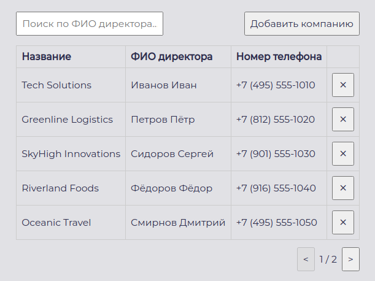
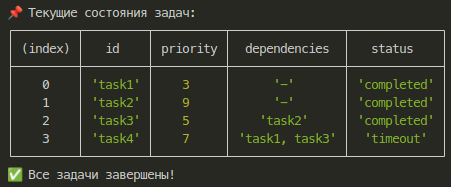

# Тестовое задание

## Проест на Vue 3
### Цель 
При помощи фреймворка Vue.js необходимо разработать одностраничное приложение - справочник
организаций.

### Стек технологий
- JavaScript
- Vue 3
- VueX
- Vite
- sass

### Результат


### Команды для запуска
1. Установка всех необходимых зависимостей
``` sh
npm i
```
2. Запуск приложения
``` sh
npm run dev
```

Приложение запуститься по адресу http://localhost:5173/

## Структура данных
### Цель 
Создать систему, которая позволяет эффективно управлять выполнением асинхронных задач с учетом приоритетов и зависимостей.

### Стек технологий
- TypeScript

### Результат


### Команды для запуска
1. Установка всех необходимых зависимостей
``` sh
npm i
```
2. Запуск приложения
``` sh
npm start
```